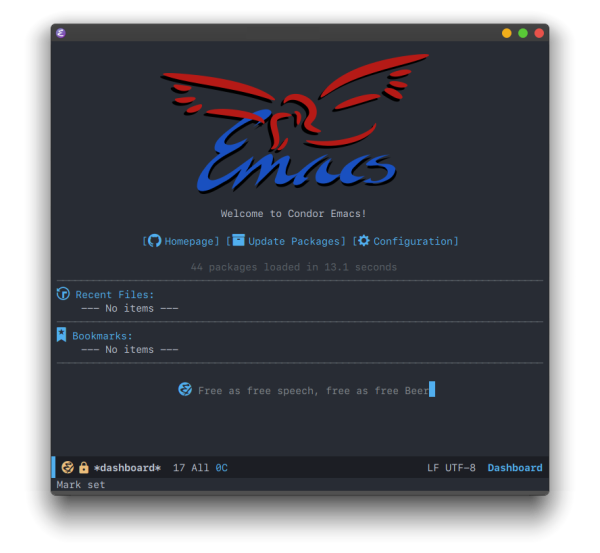
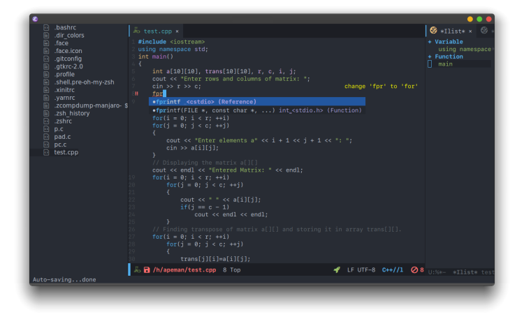
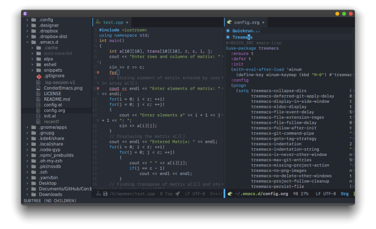
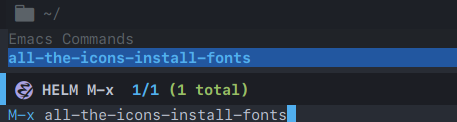
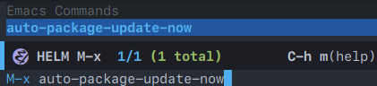

<h1 align="center">Condor Emacs</h1>
<p align="center">
  
</p>

# Introduction

<p align="justify">
  <b>Condor Emacs</b> is an option to take the Emacs experience just out of the box, designed for the newbie and the expert.
 At this time, this version is only focused to be a C and C++ languages IDE. But very soon will have support for more languages.
  For the moment this is just a beta, any help with this project is welcome.
</p>

<p align="center">
  <a href="https://github.com/apemangr/Condor-Emacs/releases"><b>Downloads</b></a> |
  <a href="https://github.com/apemangr/Condor-Emacs/wiki/"><b>Wiki</b></a> |
  <a href="https://apemangr.github.io/Condor-Emacs-Docs/"><b>Documentation</b></a>
</p>

<p align="center">
  
    
   
</p>


# Table of Contents

- [Introduction](#introduction)

- [Features](#features)

- [Screenshots](#screenshots)

- [Prerequisites](#prerequisites)
    - [Emacs](#emacs)
        - [Linux](#linux)
        - [macOS](#macos)
        - [Windows](#windows)
- [Installation](#installation)
- [Programming language support](#programming-language-support)
- [Updates](#updates)
    - [Condor Emacs Release](#condor-emacs-release)
    - [Packages](#packages)
- [License](#license)


# Features

- **Real-time diagnostics**
- **Simple configuration**
- **Full documented**
- **Code completion**
- **Out of the box**
- **Beatiful GUI**
- **Easy to use**
- **Formatting**
- **Highlights**
- **Hovers**

# Screenshots

<p align="center">
  
  
    
</p>

# Prerequisites

## Emacs

To run Condor Emacs you need to have Emacs 25 or above and all corresponding dependencies (This version was built in Emacs 26.3).

### Linux

You can install Emacs from your favorite package manager of your Linux distribution. The package name is "emacs".

**Arch Linux**
```sh
$ sudo pacman -S emacs
```
**Ubuntu**
```sh
$ sudo apt-get install emacs
```
**Fedora**
```sh
$ sudo dnf install emacs
```
**OpenSUSE**
```sh
$ sudo zypper install emacs
```
**Note:** Condor Emacs has been tested correctly in Arch Linux with KDE and Xfce desktop enviroments.

### macOS

It's recommended to use [homebrew](https://brew.sh/).
```sh
$ brew tap d12frosted/emacs-plus
$ brew install emacs-plus
$ brew linkapps emacs-plus
```
This will install a version of Emacs with support of several features.

For more information about homebrew, please visit https://docs.brew.sh/.

**Using MacPorts:**

```sh
$ sudo port install emacs-app
```

The [Emacs for OSX](https://emacsformacosx.com/) website also provides universal binaries.

**NOTE:** Condor Emacs has not been tested yet on macOS (Help needed).

### Windows

GNU Emacs for Windows can be downloaded from a [nearby GNU mirror](http://espejito.fder.edu.uy/gnu/emacs/windows/); or the [main GNU FTP server](http://ftp.gnu.org/gnu/emacs/windows/).

Unzip the zip file preserving the directory structure, and run bin\runemacs.exe. Alternatively, create a desktop shortcut to **bin\runemacs.exe**, and start Emacs by double-clicking on that shortcut's icon.

The Windows binaries are signed by Phillip Lord **8493 0FFB 79B6 45F7 DEA2 9AD0 AC6D D3FF D1D0 46BD**.

MSYS2 users can install Emacs (64bits build) with the following:

```sh
$ pacman -S mingw-w64-x86_64-emacs
```
For the 32bits build, evaluate:

```sh
$ pacman -S mingw-w64-i686-emacs
```

**NOTE:** Condor Emacs has not been tested yet on Windows.

Source: [GNU Emacs site](https://www.gnu.org/software/emacs/download.html#windows)

# Installation
**1. Make a backup of your Emacs config files**
```sh
$ cd ~
$ mv .emacs.d EmacsBackup
$ mv .emacs EmacsBackup
```
That will create a backup folder in your home directory called EmacsBackup.

**2. Clone the repository**

```sh
$ git clone https://github.com/apemangr/Condor-Emacs.git ~/.emacs.d
```
Make sure that the .emacs.d folder does not exist before cloning the repository.

**3. Install all-the-icons fonts**

For the emacs symbols to work correctly you will have to open emacs and press **M-x** and then write **all-the-icons-install-fonts**.
<p align="center">
  
</p>

**4. (Optional) Install SF Mono Fonts**

Condor Emacs has this font family by default, if you want to have a version like the screenshots, it's recommended that you install them.

# Programming language support

| Language    | Support | Completion | Highlight | Real-time Diagnostics |
|-------------|---------|------------|-----------|-----------------------|
| C           | Yes     | Yes        | Yes       | Yes                   |
| C++         | Yes     | Yes        | Yes       | Yes                   |
| Objective-C | Yes     | Yes        | Yes       | Yes                   |
| CUDA        | Yes     | Yes        | Yes       | Yes                   |
| Java        | Soon    | Soon       | Soon      | Soon                  |
| JavaScript  | Soon    | Soon       | Soon      | Soon                  |
| Rust        | Soon    | Soon       | Soon      | Soon                  |
| Python      | Soon    | Soon       | Soon      | Soon                  |
| Ruby        | Soon    | Soon       | Soon      | Soon                  |
| Lua         | Soon    | Soon       | Soon      | Soon                  |
| Haskell     | Soon    | Soon       | Soon      | Soon                  |

# Updates

## Condor Emacs Release

To update to the latest version write the following code in the master branch, including the last version release.
```sh
git fetch
git reset --hard <tag version which you are updating to>
```
## Packages
In the main buffer called **Dashboard** you can press the **"Update Packages"** button to automatically updates all the packages.

<p align="center">
  
</p>

You can also type **M-x** and **auto-package-update-now.** 

<p align="center">
  
</p>

# License

The license is GPLv3 for all parts specific to Condor Emacs.
